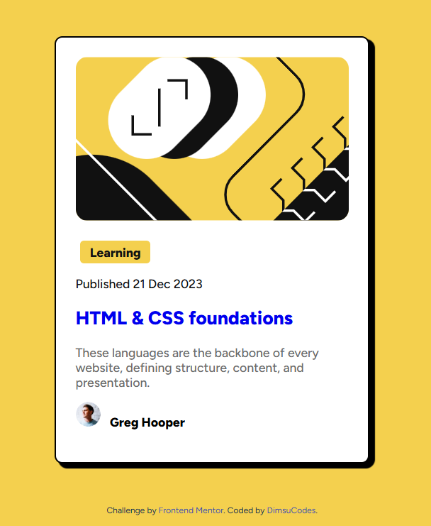

# Blog Preview Card

A responsive blog preview card built with HTML and CSS. It's a solution to the [Blog preview card challenge on Frontend Mentor](https://www.frontendmentor.io/challenges/blog-preview-card-ckPaj01IcS).

## Table of contents

- [Overview](#overview)
  - [The challenge](#the-challenge)
  - [Screenshot](#screenshot)
  - [Links](#links)
- [My process](#my-process)
  - [Built with](#built-with)
  - [What I learned](#what-i-learned)
  - [Continued development](#continued-development)
- [Author](#author)

## Overview

### The challenge

Users should be able to:

- See hover and focus states for all interactive elements on the page
- View the card centered on the page on any screen size

### Screenshot




## My process

### Built with

- Semantic HTML5 markup
- CSS custom styling
- Flexbox
- [Figtree](https://fonts.google.com/specimen/Figtree) font from Google Fonts

### What I learned

**Centering with Flexbox.** The whole card sits in the middle of the viewport using flex on the `body` with `min-height: 100vh`:

```css
body {
  display: flex;
  flex-direction: column;
  justify-content: center;
  align-items: center;
  min-height: 100vh;
  margin: 0;
}
```

**The offset "hard" shadow.** A box shadow with no blur gives the card its bold, retro look:

```css
.white-box {
  border: 2px solid black;
  border-radius: 10px;
  box-shadow: 6px 5px 1px 1px #000000;
}
```

**Avatar row alignment.** Flexbox with `gap` keeps the author image and name lined up neatly:

```css
.avatar {
  display: flex;
  align-items: center;
  gap: 12px;
}

.avatar-img {
  width: 32px;
  height: 32px;
  border-radius: 50%;
}
```

**Hover states on links.** The title changes to the accent yellow on hover:

```css
a:hover {
  color: hsl(47, 88%, 63%);
}
```

### Continued development

- Use CSS custom properties (variables) for the color palette instead of repeating HSL values
- Use `max-width` instead of a fixed `width` so the card scales better on small screens
- Add `:focus-visible` styles alongside `:hover` for keyboard users
- Try a mobile-first approach with media queries

## Author

- Frontend Mentor - [@DimsuCodes](https://www.frontendmentor.io/profile/DimsuCodes)
- GitHub - [@DimsuCodes](https://github.com/DimsuCodes)
